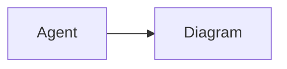

# Mermaid diagrams

In web and desktop, fenced code blocks labeled `mermaid` render as diagrams after
the reply finishes streaming. For example:

````markdown

````

Choose **Source** to read the Mermaid code and **Diagram** to return to the preview.
The copy button always copies the original code. Diagrams follow light and dark
mode and render on your device without a third-party rendering service.

Invalid diagrams and diagrams over 50,000 characters show their source instead.
Diagram links are not interactive. Native mobile currently shows Mermaid as code.
